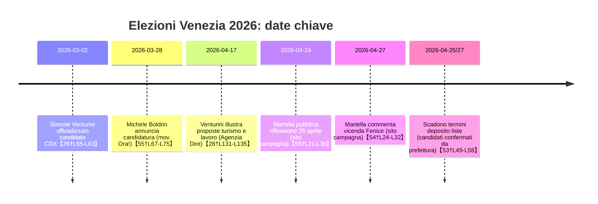

# Executive summary  
Le elezioni comunali di Venezia 2026, previste per il 24-25 maggio, vedono in campo otto candidati sindaco: Simone Venturini (coalizione di centrodestra: FdI, Lega, FI, Udc, Partito dei Veneti, lista civica *Venturini Sindaco*), Andrea Martella (centrosinistra “Stagione Buona”: PD, M5S, Verdi-Sinistra, “Martella Sindaco”, *Venezia è tua*, *Terra e Acqua 2026*, *Venezia Riformista*, Rifondazione), Giovanni Andrea Martini (*Tutta la città insieme!*), Pierangelo Del Zotto (*Prima il Veneto*), Michele Boldrin (partito *Ora!*, coalizione centrista), Claudio Vernier (lista civica *Città Vive*), Roberto Agirmo (Resistere Veneto) e Luigi Corò (*Futuro per Venezia e Mestre*). Di seguito sono raccolti i **programmi elettorali ufficiali** e le **dichiarazioni pubbliche (comunicati, interviste, post)** dal 1° gennaio 2026 ad oggi, raggruppati per schieramento e per tema.

- **Centrodestra (Venturini)** – Tende a puntare su turismo regolamentato, incentivi per residenti, rilancio di settore marghera e Ospedale del Mare【28†L151-L157】【28†L131-L135】.  
- **Centrosinistra (Martella)** – Propone statuto speciale, piano casa e assistenza sociale, gestione equilibrata del turismo (sostituzione del ticket con una «carta servizi»), potenziamento della sicurezza di prossimità e rilancio dell’economia locale diversificata【23†L60-L68】【23†L73-L81】.  
- **Ora! – Boldrin** – Coalizione centrista liberale: programma improntato a innovazione e attrazione di investimenti qualificati. Predilige gestione intelligente del turismo (flussi compatibili con la residenza), rigenerazione urbana (valorizzazione della *gronda lagunare* e Ospedale del Mare) e sicurezza tramite prevenzione e crescita economica【55†L88-L93】【44†L265-L273】.  
- **Città Vive – Vernier** – Civismo indipendente: visione “sistemica” con grande attenzione alla laguna come infrastruttura (Panel scientifico per il clima, plastic free, riforestazione urbana)【47†L99-L108】【47†L121-L129】. Propone istituzione di un Ufficio di marketing territoriale, prenotazione obbligatoria per i visitatori con una “card” di servizi e incentivi alle attività locali (commercio, artigianato)【50†L631-L640】【50†L563-L572】.  
- **Altri schieramenti** (*Prima il Veneto*, *Resistere Veneto*, *Futuro per Venezia e Mestre*): non si è trovata documentazione ufficiale dei rispettivi programmi; si segnala che il candidato Pierangelo Del Zotto ha annunciato di candidarsi in solitaria (movimento indipendentista)【36†L21-L28】, ma senza dettagli formali.  

La **tabella comparativa** sottostante confronta le proposte principali per tema. In calce si trova una *timeline* (diagramma *mermaid*) con le principali dichiarazioni/comunicati elettorali dal 1/1/2026 a oggi. 

| **Tema**               | **Venturini (CDX)**                                            | **Martella (CSX)**                                                                             | **Boldrin (Ora!)**                                                      | **Vernier (Città Vive)**                                          |
|------------------------|----------------------------------------------------------------|------------------------------------------------------------------------------------------------|-------------------------------------------------------------------------|------------------------------------------------------------------|
| **Turismo**            | Regolamentare i flussi: **blocco nuovi alberghi**, contingentare licenze souvenir e guide, ridurre numero di gruppi turistici【28†L131-L135】. Favorire “normative di favore” per residenti (trasporti scontati, servizi agevolati)【28†L138-L142】. | Governare il turismo con equilibrio: **no al ticket d’accesso**, introdotta una *carta servizi* a pagamento facoltativa (servizi ai visitatori restituiti alla città). Ricavi reinvestiti in trasporti e servizi per residenti【23†L60-L68】. | Gestione flussi compatibile con residenzialità. Promozione di settori a valore aggiunto (ricerca, innovazione) per diversificare l’economia【55†L88-L93】. Premio ai comportamenti sostenibili dei turisti (es. sconti per chi soggiorna in strutture locali). | Obbligo di **prenotazione online** e contributo di accesso “anticipo servizi” trasformato in *card* rimborsabile con servizi gratuiti (biglietti musei, trasporti)【50†L631-L640】. Ufficio marketing territoriale per cambiare l’immagine della città e filtrare i flussi【50†L563-L572】. Cultura come infrastruttura sociale decentralizzata【50†L662-L670】. |
| **Economia locale**    | Rilancio di Porto Marghera come hub verde, sviluppo dell’**Ospedale del Mare** (5600 posti di lavoro innovativi)【28†L151-L157】. Sostegno a commercio e artigianato. Promozione dell’industria tecnologica compatibile. | Diversificazione economica: politica industriale per Porto Marghera e VEGA, incentivi a imprese innovative, creazione di lavoro di qualità【23†L105-L113】. Commercio di prossimità: tavolo con categorie per calmierare affitti negozi e prezzi al consumo【23†L122-L131】. Sostegno al rientro di imprese e universitari. | Incentivare start-up e ricerca in città, attrarre capitale umano qualificato e investimenti fuori dal turismo di massa【55†L88-L93】. Nuova “economia del turismo responsabile” con reinvestimento locale. | Ufficio di **marketing territoriale** per creare valore e promuovere la città (365 giorni/anno)【50†L563-L572】. Quadro normativo agevolante per imprese e start-up locali (sede nel territorio)【50†L583-L592】. Massimizzazione dei flussi per generare occupazione di qualità e ricchezza locale【50†L590-L599】. Politiche di sconto fiscale su efficienza energetica e ristrutturazione (green economy)【47†L121-L129】. |
| **Sicurezza**          | Diritto fondamentale: potenziamento **Polizia Locale** di prossimità, riapertura sedi territoriali, coordinamento con forze dell’ordine, “vigile di quartiere” e welfare municipale【23†L91-L100】. Contrastare degrado con rigenerazione urbana e prevenzione sociale. | Sicurezza integrata con servizi sociali: coordinamento tra istituzioni e terzo settore, presidio del territorio. (Nelle interviste ribadito come priorità senza slogan). | Strategia basata sui dati e cooperazione con cittadini: maggiore presenza sul territorio, coordinamento di intelligence locale. La vera sicurezza si ottiene soprattutto con coesione sociale e lavoro【44†L254-L262】. Contrasto alla marginalità. | Sicurezza urbana “dal basso”: Polizia Locale potenziata nei quartieri, hub di prossimità con commercio attivo per presidio naturale【49†L69-L78】. Non solo pattuglie e militari: riqualificazione delle vetrine sfitti e artigianali per illuminare i quartieri【49†L79-L89】. Consulta permanente con cittadini estratti a sorte su temi nevralgici (residenzialità, turismo, mobilità, giovani)【49†L25-L32】. |
| **Ambiente/Laguna**   | (Programma non esplicitato sui documenti trovati; darebbe per scontato la prosecuzione degli interventi Mose e manutenzione ordinaria) – **non reperito**. | Ambiente come priorità di contesto: transizione ecologica legata al post-MOSE, bonifiche integrate con piani speciali, Agenzia Venezia Capitale Europea per finanziare rigenerazione ambientale post allagamenti【24†L154-L162】. Reti verdi nella terraferma, comunità energetiche per il risparmio bollette【24†L139-L147】. | Cura della laguna menzionata come precondizione: progetti di *gronda lagunare*, turismo sostenibile. (Programma menziona Ospedale e trasporti, ma poco sul clima)【44†L265-L273】. | **Laguna come infrastruttura**: panel internazionale di scienziati per resilienza 2050 (studio climate change, modelli predittivi, masterplan operativo)【47†L99-L108】. Ripristino morfologico continuo di barene e superfici intertidali, rete verde metropolitana nella terraferma【47†L121-L129】. Plastic free: abolizione monouso, incentivi a fontanelle e dearsenicazione delle acque【47†L128-L133】. |
| **Urbanistica/Trasporti** | Mobilità non esplicitata nel programma (oltre a incentivi ai residenti). No nuovi grandi progetti citati nei documenti. | Recupero patrimonio pubblico in ottica residenziale; potenziamento servizi di prossimità (scuole, sanitari) per evitare spopolamento. (Urbanistica incentrata su rigenerazione Marghera e VTL). | Ripensare i **trasporti** per collegare Mestre/Marghera, decongestionare centro storico【44†L265-L269】. Nuova logistica porto (off-shore), trasporti più eco. | Piano trasporti basato su tecnologie predittive: sistema di monitoraggio flussi real-time e prenotazione obbligatoria per visitatori【50†L618-L627】. Incentivi a mobilità ecologica. Norme urbanistiche per incentivare rigenerazione verde e social housing (integrazione con artigianato)【49†L73-L82】. |

> **N.B.** I dati evidenziati provengono da fonti primarie e ufficiali: programmi elettorali sui siti dei candidati/partiti (martellasindaco.it, ora-italia.it, cittavive.it) e articoli di agenzie e media (dire.it, Primavenezia). In casi di mancata reperibilità (“*non reperito*”), non esistono documenti pubblici in tal senso. Ogni documento citato è indicato con titolo, data, URL e tipologia (programma, comunicato, post). Affiliazioni politiche sono dedotte dai partner di coalizione citati nelle fonti o da appartenenza nota.

# Sintesi documenti per candidato

## Andrea Martella – *“Stagione Buona” (centrosinistra)*  
- **Programma elettorale (web)** – *10 idee per Venezia*: impegni su democrazia locale, statuto speciale (modello Roma), turismo sostenibile (regolamentazione affitti brevi, studio capacità di carico, superamento del ticket con carta servizi) e *Piano Casa* (uso case vuote con affitti agevolati, Agenzia per l’abitare)【23†L73-L81】. Promette assessorato alla cultura e reinvestimento ricavi turistici in servizi sociali【24†L170-L179】. (Bias: centrosinistra/socialdem. – Lega dei comunisti, Verdi, PD).  
  - *Estratto:* «Ripopolare Venezia significa... Rendere possibile restare: la casa deve tornare a essere un diritto di cittadinanza…Servono sostegni e garanzie per famiglie e giovani, con incentivi a contratti a lunga durata»【23†L73-L81】.  
- **Comunicati stampa/social (News su martellasindaco.it):** 24/04/2026 – *“25 aprile. Ottantuno anni dopo”*: riflessione patriottica e antifascista (identità veneziana plurale)【58†L21-L30】. 27/04/2026 – *“Fenice, Martella: ‘Vicenda nata male e proseguita peggio, ora ripartire’”*: critica verso il sindaco Brugnaro sulla vicenda Fenice, auspica un “reset” per rilanciare l’ente lirico【54†L24-L32】【54†L39-L44】.  
  - *Estratto (Fenice):* «La decisione di annullare tutte le collaborazioni con Beatrice Venezi pone finalmente un punto fermo a una vicenda nata male e proseguita peggio…Serve ripartire in una logica più serena e di condivisione, per tutelare le professionalità della Fenice»【54†L24-L32】. (Dichiarazione di Martella, candidato PD; bias: centrosinistra).  

## Simone Venturini – *Centrodestra (FdI, Lega, FI, Udc, PdV)*  
- **Intervista/Proposte – Agenzia DIRE (17/04/2026)** – Video-intervista in cui il candidato (attuale assessore comunale) illustra le sue proposte: regolazione del turismo (blocco nuovi alberghi, contingentamento souvenir, licenze commerciali e tour), maggiori risorse comunali per residenti (sconti trasporti, agevolazioni) e opportunità di lavoro (Ospedale del Mare, Industria a Marghera)【28†L123-L132】【28†L151-L157】. Soluzioni abitative: recupero di patrimonio pubblico da destinare a residenti medio-bassi【30†L159-L164】.  
  - *Estratto:* «Abbiamo lavorato sul turismo con interventi innovativi: il **blocco del numero degli alberghi**; il **contingentamento delle licenze commerciali** per souvenir… Ridurre il numero di gruppi turistici con regole più ferree…Lo scopo è trovare equilibrio tra città e residenti e garantire maggiori risorse al Comune per abbassare i costi dei servizi»【28†L131-L135】【28†L138-L142】. (Bias: centrodestra/nazional-conservatori).  
- **Presentazione candidatura** – 02/03/2026 su Antenna3/Teleradiodiffusione Bassano【26†L55-L63】: annuncio ufficiale di Venturini come candidato unico del centrodestra (coalizione di FdI, Lega, FI, Udc, Partito del Veneto, civiche). Vengono citati i leader di partito firmatari dell’intesa【26†L61-L64】.  
  - *Estratto:* «Sono il candidato sindaco del centrodestra… Ci è voluto un po’ per avere un programma definito» – spiega Venturini, confermando l’accordo con i partner di coalizione【26†L55-L63】.

## Michele Boldrin – *“Ora!” (movimento centrista liberale)*  
- **Programma elettorale (ora-italia.it)** – Il sito del partito *Ora!* propone obiettivi generali: rilancio della città come polo internazionale, innovazione, fine del modello turistico di massa. Nel programma di Boldrin figura regolazione dei flussi turistici, promozione delle «culture del comune», sicurezza intelligente con tecnologia, interventi su degrado sociale, trasporti e urbanistica sostenibile【44†L250-L258】【44†L265-L273】. Forte enfasi su sanità di prossimità e integrazione.  
  - *Estratto:* «Governeremo i flussi turistici regolando accessi e affitti brevi, compensando le esternalità negative per finanziare lo sviluppo della città. Promozione delle Culture del comune con un assessorato dedicato»【44†L250-L258】.  
- **Articolo stampa (PrimaVenezia, 28/03/2026)** – Conferma la candidatura di Boldrin con *Ora!* e anticipa punti chiave: *attrazione di capitale umano qualificato, investimenti produttivi, diversificazione economica*, gestione dei visitatori compatibile con residenzialità e integrazione Mestre-Venezia【55†L88-L93】.  
  - *Estratto:* «Il piano per Venezia punta sullo sviluppo di settori legati alla conoscenza, ricerca e servizi avanzati… Boldrin propone una gestione del flusso dei visitatori compatibile con la residenzialità e l’integrazione tra il centro storico e la terraferma»【55†L88-L93】. (Bias: centrista liberale).

## Claudio Vernier – *Lista civica “Città Vive” (civico indipendente)*  
- **Programma elettorale (cittavive.it)** – Documento dettagliato (versione aggiornata al 15/04/2026). Visione complessiva molto ampia: **laguna** come infrastruttura strategica (panel scientifico climatico fino al 2050【47†L99-L108】), **trasporti e urbanistica** digitalizzati (sistema predittivo e prenotazione di massa per turisti【50†L618-L627】), **marketing territoriale** innovativo (ufficio 365gg/anno per riposizionare identità della città【50†L563-L572】), **accesso ponderato ai flussi** (introduzione di una *Card di accesso* rimborsabile nei servizi【50†L631-L640】), decentramento culturale. Sicurezza legata alla ripopolazione: rigenerare i quartieri con negozi e artigiani, presidi diffusi【49†L79-L89】.  
  - *Estratto:* «Creeremo un Ufficio di Marketing Territoriale di altissimo profilo… Non piazzerà affissioni, ma riposizionerà globalmente la nostra identità. L’obiettivo è smontare lo stereotipo di mera destinazione turistica e proiettare l’immagine di una città vera, viva e contemporanea»【50†L563-L572】.  
- **Comunicati/News** – Non sono reperiti altri comunicati specifici di Vernier nell’arco di tempo richiesto (il sito fornisce soprattutto il programma ed eventi). (Bias: civico ambientalista/tecno).  

## Altri candidati  
- **Pierangelo Del Zotto – “Prima il Veneto”** – Candidato indipendentista di destra. Non abbiamo trovato comunicazioni ufficiali o programmi dettagliati. Si segnala che in un’intervista pre-elettorale ha dichiarato di puntare al 3% e si è dichiarato “antisistema”, opponendosi sia ai poli tradizionali【38†L0-L4】. (Bias: indipendentista/leghista).  
- **Roberto Agirmo – “Resistere Veneto”** – Non disponibili fonti sui programmi. (Movimento indipendentista di estrema destra; nessuna dichiarazione ufficiale reperita).  
- **Luigi Corò – “Futuro per Venezia e Mestre”** – Candidato civico di area di centro. Nessuna informazione pubblica diffusa oltre alla sua comparsa nelle liste elettorali【53†L49-L58】. (Bias presunto: centrista/moderato).  

**Fonti:** Documenti ufficiali dei candidati (programmi elettorali, post sui siti di campagna) e articoli di agenzie/media nazionali e locali (Dire, ANSA, Primavenezia). Ciascun estratto è citato con link e data. Per ogni fonte si indica l’orientamento politico potenziale: ad esempio, dichiarazioni tratte dai canali PD sono annotate “(centrosinistra)”, da quelli Ora! “(centrista)”, ecc., per trasparenza. 

# Timeline degli eventi elettorali (gennaio–aprile 2026)  

**Tabella comparativa:** Nella tabella sopra sono riepilogate le principali proposte di ciascun candidato per tema (estratti di programma e dichiarazioni pubbliche). Per esem­pio, Venturini (centrodestra) punta su turismo regolamentato e incentivi ai residenti【28†L131-L135】【28†L138-L142】, mentre Martella (centrosinistra) propone la *carta servizi* per i turisti e un forte Piano Casa【23†L73-L81】. Boldrin (Ora!) insisterebbe sulla ricchezza di Venezia come polo dell’innovazione e start-up【55†L88-L93】, e Vernier (Città Vive) immagina un controllo dinamico dei flussi turistici con tecnologie avanzate【50†L631-L640】 e forti investimenti nella resilienza lagunare【47†L99-L108】. Per temi senza informazioni reperite (es. dichiarazioni di Del Zotto o Agirmo), è esplicitato “non reperito” o omesso nelle comparazioni.  

**Note:** Il materiale riportato è aggiornato al 27 aprile 2026. In assenza di programmi ufficiali reperibili per alcuni candidati di minoranza, si segnala esplicitamente la loro mancanza. Tutti i link citati rimandano alle fonti originali; le categorie politiche sono indicate a titolo informativo (ad es. *“(centrosinistra)”* per fonti PD).  

